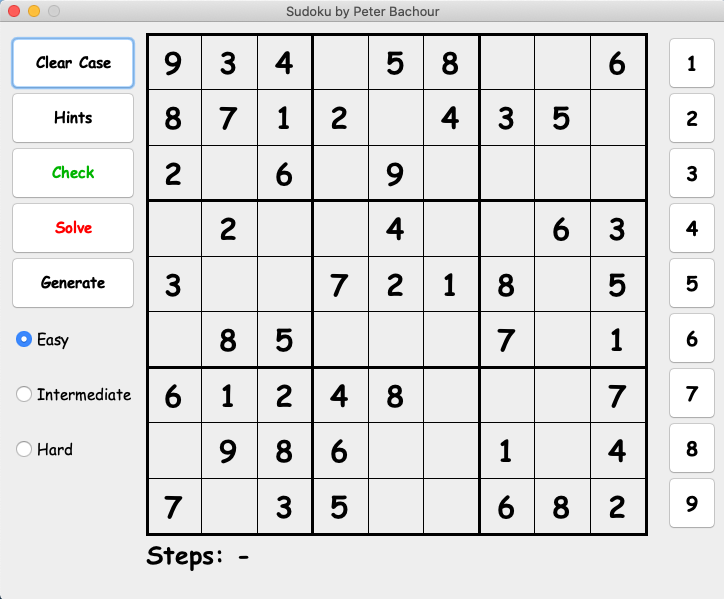

# SudokuV1

SudokuV1 is a game programmed in JAVA.

## Installation

Use the following commands in the terminal to install the application on your private computer:

```
git clone https://github.com/PeterBachour/SudokuV1.git
```

## Usage

Once the installation is done you can either enter the following commands in your terminal:
```bash
cd SudokuV1
java -jar SudokuV1.jar
```

Or either launch any IDE (preferably IntelliJ) and run the application.

Once the game is launched:
- You can create 3 difficulties for this game (Easy, Intermediate and Difficult).
- You can choose any cell in the grid and then choose a number on the right side to put that number in the cell. 
- You can use the button "Clear Case" to clear a cell in the grid.
- You can use the button "Hints" after choosing a cell to get a Hint on that cell.
- You can use the button "Check" at any time to check all the inputs you gave. If the number appears in red, this means it is wrong.
- You can use the button "Solve" at any time to solve all the grid.
- You can use the button "Generate" at any time to generate a new grid.
- You can choose which difficulty you want by just clicking on the associated button and then generating a new gird (Generate button).

At the bottom of the grid, you will see how many steps you have done. 
- Each input is a step.
- If you clear a case, it counts as a step.
- If you check your grid, it counts a step.
- If you solve the grid, the number of steps will be 0.

At the end of the game (when all the grid is filled), if you have successfully filled the grid, a congratulations message will appear. Otherwise, the wrong cells will appear in red.



## Author
Peter Bachour (peter_bachour@icloud.com)
